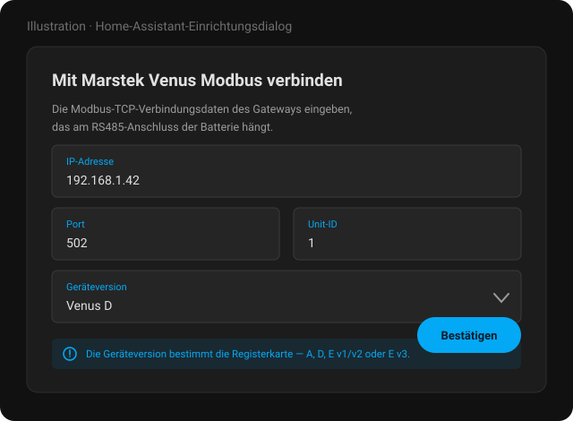

# Marstek Venus Modbus für Home Assistant

**Einen Marstek-Venus-Speicher über lokales Modbus TCP auslesen und steuern — ohne Cloud, ohne App, ohne YAML.**

[English](README.md) · **Deutsch**

> [!NOTE]
> **Dies ist ein Entwicklungs-Fork** von [ViperRNMC/marstek_venus_modbus](https://github.com/ViperRNMC/marstek_venus_modbus).
> Das Verdienst an der Integration gebührt [@ViperRNMC](https://github.com/ViperRNMC). Dieser Fork
> enthält zusätzliche Registerforschung zur Venus D sowie Fehlerkorrekturen; was genau abweicht und
> warum, steht in [UPSTREAM-DIVERGENCE.md](UPSTREAM-DIVERGENCE.md) — damit es bewusst nach upstream
> übernommen oder verworfen werden kann. Probleme mit **diesem Fork** bitte im Issue-Tracker dieses
> Repositories melden.

---

## Was diese Integration macht

Ein Marstek-Venus-Speicher legt seinen gesamten Zustand über **Modbus** offen — Ladezustand,
Leistung, Zellspannungen, Temperaturen, Energiezähler — und nimmt über dieselbe Schnittstelle auch
Befehle entgegen. Diese Custom-Integration für [Home Assistant](https://www.home-assistant.io)
spricht dieses Protokoll direkt über TCP und macht aus den Registern Home-Assistant-Entitäten.

Kein Marstek-Cloud-Konto, kein MQTT-Broker, kein YAML. Die Konfiguration läuft vollständig über die
Oberfläche.

### Warum Modbus

Bluetooth erreicht die Batterie von jeweils einem Telefon aus. Die Cloud erreicht sie von überall,
aber nur so weit, wie die Marstek-App es zulässt, und nur solange deren Dienst läuft. Modbus ist die
Schnittstelle, die immer da ist, in Millisekunden antwortet und von Wechselrichtern, SPSen und
Energiemanagern gleichermaßen gelesen wird — Home Assistant sieht damit **dieselben Zahlen aus
derselben Quelle** wie alles andere in der Anlage.

---

## Voraussetzungen

- Eine **Modbus-RTU-auf-TCP-Brücke** am RS485-Anschluss der Batterie
  - oder eine **Ethernet-Verbindung** direkt zu einer Batterie, die selbst Modbus TCP spricht (z. B. Venus E3)
- **IP-Adresse**, **Port** (in der Regel 502) und **Unit-ID** (auch Slave-ID) dieser Brücke
- Home Assistant **2025.9** oder neuer
- HACS, für eine komfortable Installation

### Getestete Hardware

| Gateway | Anmerkung |
|---|---|
| Elfin EW11 | WLAN auf RS485 |
| PUSR DR134 | Modbus-Gateway |
| Waveshare RS485 auf RJ45 | Ethernet-Konverter |
| M5Stack RS485 + Atom S3 Lite | [#25](https://github.com/ViperRNMC/marstek_venus_modbus/issues/25) |
| A / D / E v3 über Ethernet | Kein Adapter nötig — [#46](https://github.com/ViperRNMC/marstek_venus_modbus/issues/46#issuecomment-3631312782) · [#106](https://github.com/ViperRNMC/marstek_venus_modbus/issues/106) |

---

## Funktionen

- Natives Modbus-TCP-Polling über `pymodbus`, vollständig asynchron
- Zentraler `DataUpdateCoordinator` mit **Polling-Prioritäten je Entität**
- **Blockweises Lesen zusammenhängender Register** — benachbarte Register werden in einer Anfrage
  geholt, mit automatischem Rückfall auf Einzelabfragen, wenn ein Blocklesevorgang fehlschlägt
- Abfrageintervalle über die Optionen einstellbar
- Abhängige Entitäten werden immer abgefragt, auch wenn die Entität, die sie braucht, deaktiviert ist
- Sensoren für Spannung, Strom, SoC, Leistung, Energie sowie Fehler- und Alarmstatus (kombinierte Bits)
- Diagnose-Entitäten für Verbindungszustand, Firmware-Version, BLE-MAC-Adresse und die Firmware des
  Kommunikationsmoduls
- Einstellbare Lade-/Entladeleistung (modellabhängig, bis 2500 W)
- Select-Entitäten für mehrstufige Steuerung (Zwangsmodus, Netzstandard)
- Steuerung des Notstrommodus sowie Laden/Entladen auf einen Ziel-SoC
- Berechnete Sensoren: Round-Trip-Wirkungsgrad (gesamt und monatlich) und gespeicherte Energie
- Zyklensensoren: der native Zähler, wo vorhanden, plus eine berechnete Zyklenzahl
  (`entladene_Energie / Kapazität`)
- Reset-Button für das Batteriemanagementsystem
- Erweiterte Sensoren standardmäßig deaktiviert, damit die Oberfläche lesbar bleibt
- Alle Entitäten unter einem Gerät gebündelt
- Konfiguration über die UI (Config Flow) — vollständig lokal

---

## Unterstützte Geräte

| Geräteversion | Registerkarte |
|---|---|
| Venus A | `a.yaml` |
| Venus D | `d.yaml` |
| Venus E v1 / v2 | `e_v12.yaml` |
| Venus E v3 | `e_v3.yaml` |

> [!IMPORTANT]
> Venus **A**, **D** und **E v3** teilen sich eine Firmware-Basis. Venus **E v1/v2** baut auf einer
> **völlig anderen** auf — eine Registererkenntnis aus A/D/E3-Firmware sagt nichts über E v1/v2 aus,
> wo eine übereinstimmende Registernummer bis zum Gegenbeweis Zufall ist.

---

## Installation

1. Dieses Repository in HACS unter **Integrationen → Benutzerdefinierte Repositories** hinzufügen (Kategorie: Integration)
2. **Marstek Venus Modbus** installieren
3. Home Assistant neu starten
4. Die Integration über **Einstellungen → Geräte & Dienste** hinzufügen

> Die Bilder in dieser README sind Illustrationen der Dialoge, keine Fotos einer laufenden Instanz.

Hier trägt man die Adresse des Modbus-TCP-Gateways ein, den Port (Standard 502), die Unit-ID
(Standard 1, gültiger Bereich 1–255) und die Geräteversion — `A`, `D`, `E v1/v2` oder `E v3`. Die
Geräteversion wählt die Registerkarte aus und muss deshalb zur tatsächlichen Hardware passen.

---

## Entitäten

Alles landet auf einem Gerät. Erweiterte und diagnostische Entitäten sind standardmäßig deaktiviert —
was man braucht, aktiviert man gezielt in der Entitätsliste, statt sich durch alles zu wühlen.

---

## Konfiguration

### Verbindungseinstellungen

Einstellbar unter **Optionen → Verbindungseinstellungen**:

- **IP-Adresse, Port und Unit-ID** des Modbus-TCP-Gateways
- **Wartezeit zwischen Nachrichten** (Standard 80 ms) — die Pause, die die Integration zwischen zwei
  Modbus-Anfragen einhält

Die Wartezeit gilt für jede Anfrage, ein höherer Wert verlängert also jeden Abfragezyklus und den
Start der Integration im gleichen Verhältnis: Bei 300 ms braucht ein Zyklus aus 50 Anfragen
15 Sekunden, bei 80 ms wären es 4. Nur erhöhen, wenn ein Gateway beim Standardwert Antworten
verschluckt — und wieder senken, sobald die Verbindung stabil ist.

### Abfrageintervalle

Die Integration fragt gezielt ab, mit konfigurierbaren Intervallen je Klasse. Neuere Versionen
verwenden **zwei** Polling-Klassen statt vier; der Coordinator berücksichtigt weiterhin
Prioritäten je Entität, die sichtbaren Optionen beschränken sich aber auf die Intervalle, auf die es
ankommt.

| Klasse | Standard | Umfasst |
|---|---|---|
| **Hohe Priorität** | 10 s | Schnell veränderliche Werte — Leistung, Spannung, Strom, SoC, Zustandsentitäten |
| **Niedrige Priorität** | 60 s | Langsam veränderliche Werte — Summen, Diagnose, Firmware, Geräteinformationen |

Hinweise:

- Benachbarte fällige Register werden nach Möglichkeit zu einem Blocklesevorgang zusammengefasst.
- Schlägt ein Blocklesevorgang fehl, fallen die betroffenen Entitäten auf Einzelabfragen zurück.
- Deaktivierte Entitäten werden übersprungen, außer ein berechneter Sensor hängt von ihnen ab.

---

## Was lokal bleibt

Die Integration spricht mit dem eigenen Gateway und mit sonst nichts. Es ist kein Marstek-Konto
beteiligt, es gibt keine Telemetrie und keine ausgehende Verbindung außer dem einen TCP-Socket zu
der Adresse, die man konfiguriert hat.

---

## Bekannte Probleme

- **User Work Mode (AI Optimized) wird nicht korrekt zurückgemeldet**
  Setzt man `User Work Mode` in Home Assistant auf `2 (Trade Mode)`, wird der neue Zustand
  möglicherweise nicht angezeigt. Die Marstek-App zeigt den richtigen Modus, während Home Assistant
  weiterhin den vorherigen darstellt — Ursache ist eine Abweichung in der Antwort des
  Modbus-Registers. Das Problem liegt auf Firmware-Seite.

- **Die Batterie verschwindet alle 30 Minuten aus dem Netz**
  Ein paar Sekunden ohne Modbus und ohne Ping, in festem Takt. Das ist die Firmware des Geräts, die
  ihren Netzwerkchip zurücksetzt, wenn sie die Marstek-Cloud nicht erreicht — nicht diese
  Integration und nicht dein Netz. Verhindern lässt es sich von hier aus nicht, nur schnell
  überstehen, und genau das leisten 1.2.0 und neuer. Mechanismus und Abhilfe:
  **[FIRMWARE-DROPOUTS.de.md](FIRMWARE-DROPOUTS.de.md)**.

---

## Häufige Fragen

**Brauche ich ein Gateway, oder kann die Batterie selbst Modbus TCP?**
Venus A, D und E v3 lassen sich direkt per Ethernet anschließen und sprechen Modbus TCP ohne
Adapter. Für alles andere braucht es eine RS485-auf-TCP-Brücke am RS485-Anschluss der Batterie.

**Kann ich das parallel zu einem anderen Modbus-Client betreiben?**
Die meisten Gateways bedienen jeweils nur einen TCP-Client. Hält bereits ein Wechselrichter oder
Energiemanager die Verbindung, hilft entweder ein Gateway, das multiplext, oder man liest die
Batterie über dieses andere System aus.

**Warum sind so viele Entitäten standardmäßig deaktiviert?**
Weil die Registerkarte groß ist. Alles ist definiert, aber würde man alles aktiviert ausliefern,
gingen die zehn Werte unter, die die meisten tatsächlich wollen. Was man braucht, aktiviert man in
der Entitätsliste.

**Funktioniert das zusammen mit venuscontrol?**
Ja, und beides ergänzt sich: [venuscontrol](https://github.com/sphings79/venuscontrol) konfiguriert
die Batterie über Bluetooth — inklusive des Einschaltens der Schnittstellen, die diese Integration
danach über Modbus ausliest.

**Ist meine Venus E v1/v2 vollständig unterstützt?**
Sie ist in `e_v12.yaml` definiert, läuft aber auf einer anderen Firmware-Basis, und die
Registerforschung in diesem Fork stammt von A/D/E3-Hardware. Erkenntnisse zu E v1/v2 sind daher als
unbestätigt zu behandeln.

---

## Verwandte Projekte

- 🖥️ **[venuscontrol](https://github.com/sphings79/venuscontrol)** — cloudfreie
  Web-Bluetooth-Steuerung für Venus A / D, inklusive OTA-Firmware-Updates
- 📦 **[Marstek-Firmware-Archiv](https://github.com/sphings79/marstek-firmware-archiv)**
- 🛰️ **[Marstek Offline Endpoint](https://github.com/sphings79/Marstek-offline-endpoint)** — beantwortet den
  Telemetrie-Upload lokal, beendet damit die 30-Minuten-Ausfälle und behält die Daten im Haus
- 🔬 **[Reverse Engineering der Venus-D-Firmware](https://github.com/sphings79/Marstek-Venus-D-Firmware-Reverse-Engineering)**
- 🌐 **[Weitere Projekte und Tools](https://sphings-dev.de/)**

## Dank

- Upstream-Integration: **[ViperRNMC/marstek_venus_modbus](https://github.com/ViperRNMC/marstek_venus_modbus)**

---

## 📘 Verwendete Modbus-Register

Die Registerdefinitionen liegen in `custom_components/marstek_modbus/registers/`.

Die folgende Tabelle listet je Schlüssel die beschreibenden Felder und das Register auf, das in der jeweiligen YAML-Datei definiert ist. Die Spalten `Type`, `Bytes`, `Scale` und `Unit` stammen aus den YAML-Definitionen, sofern dort vorhanden.

| Schlüssel / Name                  | Beschreibung                               | Type    | Bytes | Scale  | Unit | a     | d     | e_v12 | e_v3 |
|:----------------------------------|:-------------------------------------------|:--------|:-----:|:------:|:----:|:-----:|:-----:|:------:|:-----:|
| device_name                       | Gerätename (String)  | char    | 20   | -      | -    | 31000 | 31000 | 31000 | 31000 |
| sn_code                           | Seriennummer / SN-Code  | char    | 20   | -      | -    |       |       | 31200 |       |
| software_version                  | Software-Version des Geräts | uint16  | 2    | 0.01   | -    |       |       | 31100 |       |
| bms_version                       | BMS-Firmware-Version | uint16  | 2    | -      | -    | 30204 | 30204 | 31102 | 30204 |
| vms_version                       | VMS-Firmware-Version | uint16  | 2    | -      | -    | 30202 | 30202 |       | 30202 |
| ems_version                       | EMS-Firmware-Version (besondere Formatierung) | uint16  | 2    | 1      | -    | 30200 | 30200 | 31101 | 30200 |
| firmware_version                  | Zusammengesetzter Firmware-Versionsstring | calculated | - | - | - |  |  |  |  |
| ble_mac_address                   | BLE-MAC-Adresse | mac     | 12   | -      | -    | 30304 | 30304 | 30402 | 30304 |
| comm_module_firmware              | Firmware des Kommunikationsmoduls | char    | 12   | -      | -    | 30350 | 30350 | 30800 | 30350 |
| wifi_signal_strength              | WLAN-RSSI | uint16  | 2    | -1     | dBm  | 30303 | 30303 | 30303 | 30303 |
| bluetooth_status                  | Bluetooth-Verbindung/-Status  | uint16  | 2    | -      | -    | 30301 | 30301 | 30301 | 30301 |
| wifi_status (binary)              | WLAN verbunden (0/1) | uint16  | 2    | 1      | -    | 30300 | 30300 | 30300 | 30300 |
| cloud_status (binary)             | Cloud verbunden (0/1) | uint16  | 2    | 1      | -    | 30302 | 30302 | 30302 | 30302 |
| battery_soc                       | Ladezustand     | uint16  | 2    | 0.1/1  | %    | 34002 | 34002 | 32104 | 34002 |
| battery_total_energy              | Gesamte gespeicherte Energie | uint16  | 2    | 0.001  | kWh  | 32105 | 32105 | 32105 | 32105 |
| battery_voltage                   | Batteriespannung | uint16  | 2    | 0.01   | V    | 30100 | 30100 | 32100 | 30100 |
| battery_current                   | Batteriestrom   | int16   | 2    | 0.1/0.01| A   | 30101 | 30101 | 32101 | 30101 |
| battery_power                     | Batterieleistung | int16/32| 2/4  | 1      | W    | 30001 | 30001 | 32102 | 30001 |
| total_charging_energy             | Gesamte Ladeenergie   | uint32  | 4    | 0.01   | kWh  | 33000 | 33000 | 33000 | 33000 |
| total_discharging_energy          | Gesamte Entladeenergie   | int32   | 4    | 0.01   | kWh  | 33002 | 33002 | 33002 | 33002 |
| total_daily_charging_energy       | Gesamte tägliche Ladeenergie | uint32  | 4    | 0.01   | kWh  | 33004 | 33004 | 33004 | 33004 |
| total_daily_discharging_energy    | Gesamte tägliche Entladeenergie | int32   | 4    | 0.01   | kWh  | 33006 | 33006 | 33006 | 33006 |
| total_monthly_charging_energy     | Gesamte monatliche Ladeenergie | uint32  | 4    | 0.01   | kWh  | 33008 | 33008 | 33008 | 33008 |
| total_monthly_discharging_energy  | Gesamte monatliche Entladeenergie | int32   | 4    | 0.01   | kWh  | 33010 | 33010 | 33010 | 33010 |
| battery_cycle_count               | Nativer Zyklenzähler | uint16  | 2    | 1      | -    | 34003 | 34003 |       | 34003 |
| ac_voltage                        | AC-Spannung | uint16  | 2    | 0.1    | V    | 32200 | 32200 | 32200 | 32200 |
| ac_current                        | AC-Strom   | int16   | 2    | 0.004/0.01| A  | 37004 | 37004 | 32201 | 37004 |
| ac_power                          | AC-Leistung | int16/32| 2/4  | 1      | W    | 30006 | 30006 | 32202 | 30006 |
| ac_frequency                      | AC-Frequenz  | int16   | 2    | 0.1/0.01| Hz  | 32204 | 32204 | 32204 | 32204 |
| ac_offgrid_voltage                | AC-Inselbetrieb-Spannung | uint16  | 2    | 0.1    | V    | 32300 | 32300 | 32300 | 32300 |
| ac_offgrid_current                | AC-Inselbetrieb-Strom | uint16  | 2    | 0.01   | A    | 32301 | 32301 | 32301 | 32301 |
| ac_offgrid_power                  | AC-Inselbetrieb-Leistung | int32   | 4    | 1      | W    | 32302 | 32302 | 32302 | 32302 |
| internal_temperature              | Interne Gerätetemperatur    | int16   | 2    | 0.1    | °C   | 35000 | 35000 | 35000 | 35000 |
| internal_mos1_temperature         | Interne Temperatur MOS1   | int16   | 2    | 0.1    | °C   | 35001 | 35001 | 35001 | 35001 |
| internal_mos2_temperature         | Interne Temperatur MOS2   | int16   | 2    | 0.1    | °C   | 35002 | 35002 | 35002 | 35002 |
| max_cell_temperature              | Maximale Zelltemperatur | int16   | 2    | 0.1/1  | °C   | 35010 | 35010 | 35010 | 35010 |
| max_cell_voltage                  | Maximale Zellspannung | uint16  | 2    | 0.001  | V    | 37007 | —     | 37007 | 37007 |
| min_cell_voltage                  | Minimale Zellspannung | uint16  | 2    | 0.001  | V    | 37008 | —     | 37008 | 37008 |
| battery_1_cell_1_voltage            | Spannung Akkupack 1 Zelle 1   | int16   | 2    | 0.001  | V    | 34018 | 34018 |       | 34018 |
| battery_1_cell_2_voltage            | Spannung Akkupack 1 Zelle 2   | int16   | 2    | 0.001  | V    | 34019 | 34019 |       | 34019 |
| battery_1_cell_3_voltage            | Spannung Akkupack 1 Zelle 3   | int16   | 2    | 0.001  | V    | 34020 | 34020 |       | 34020 |
| battery_1_cell_4_voltage            | Spannung Akkupack 1 Zelle 4   | int16   | 2    | 0.001  | V    | 34021 | 34021 |       | 34021 |
| battery_1_cell_5_voltage            | Spannung Akkupack 1 Zelle 5   | int16   | 2    | 0.001  | V    | 34022 | 34022 |       | 34022 |
| battery_1_cell_6_voltage            | Spannung Akkupack 1 Zelle 6   | int16   | 2    | 0.001  | V    | 34023 | 34023 |       | 34023 |
| battery_1_cell_7_voltage            | Spannung Akkupack 1 Zelle 7   | int16   | 2    | 0.001  | V    | 34024 | 34024 |       | 34024 |
| battery_1_cell_8_voltage            | Spannung Akkupack 1 Zelle 8   | int16   | 2    | 0.001  | V    | 34025 | 34025 |       | 34025 |
| battery_1_cell_9_voltage            | Spannung Akkupack 1 Zelle 9   | int16   | 2    | 0.001  | V    | 34026 | 34026 |       | 34026 |
| battery_1_cell_10_voltage           | Spannung Akkupack 1 Zelle 10   | int16   | 2    | 0.001  | V    | 34027 | 34027 |       | 34027 |
| battery_1_cell_11_voltage           | Spannung Akkupack 1 Zelle 11   | int16   | 2    | 0.001  | V    | 34028 | 34028 |       | 34028 |
| battery_1_cell_12_voltage           | Spannung Akkupack 1 Zelle 12   | int16   | 2    | 0.001  | V    | 34029 | 34029 |       | 34029 |
| battery_1_cell_13_voltage           | Spannung Akkupack 1 Zelle 13   | int16   | 2    | 0.001  | V    | 34030 | 34030 |       | 34030 |
| battery_1_cell_14_voltage           | Spannung Akkupack 1 Zelle 14   | int16   | 2    | 0.001  | V    |       | 34031 |       | 34031 |
| battery_1_cell_15_voltage           | Spannung Akkupack 1 Zelle 15   | int16   | 2    | 0.001  | V    |       | 34032 |       | 34032 |
| battery_1_cell_16_voltage           | Spannung Akkupack 1 Zelle 16   | int16   | 2    | 0.001  | V    |       | 34033 |       | 34033 |
| battery_2_cell_1_voltage            | Spannung Akkupack 2 Zelle 1   | int16   | 2    | 0.001  | V    | 34031 |       |       |       |
| battery_2_cell_2_voltage            | Spannung Akkupack 2 Zelle 2   | int16   | 2    | 0.001  | V    | 34032 |       |       |       |
| battery_2_cell_3_voltage            | Spannung Akkupack 2 Zelle 3   | int16   | 2    | 0.001  | V    | 34033 |       |       |       |
| battery_2_cell_4_voltage            | Spannung Akkupack 2 Zelle 4   | int16   | 2    | 0.001  | V    | 34034 |       |       |       |
| battery_2_cell_5_voltage            | Spannung Akkupack 2 Zelle 5   | int16   | 2    | 0.001  | V    | 34035 |       |       |       |
| battery_2_cell_6_voltage            | Spannung Akkupack 2 Zelle 6   | int16   | 2    | 0.001  | V    | 34036 |       |       |       |
| battery_2_cell_7_voltage            | Spannung Akkupack 2 Zelle 7   | int16   | 2    | 0.001  | V    | 34037 |       |       |       |
| battery_2_cell_8_voltage            | Spannung Akkupack 2 Zelle 8   | int16   | 2    | 0.001  | V    | 34038 |       |       |       |
| battery_2_cell_9_voltage            | Spannung Akkupack 2 Zelle 9   | int16   | 2    | 0.001  | V    | 34039 |       |       |       |
| battery_2_cell_10_voltage           | Spannung Akkupack 2 Zelle 10   | int16   | 2    | 0.001  | V    | 34040 |       |       |       |
| battery_2_cell_11_voltage           | Spannung Akkupack 2 Zelle 11   | int16   | 2    | 0.001  | V    | 34041 |       |       |       |
| battery_2_cell_12_voltage           | Spannung Akkupack 2 Zelle 12   | int16   | 2    | 0.001  | V    | 34042 |       |       |       |
| battery_2_cell_13_voltage           | Spannung Akkupack 2 Zelle 13   | int16   | 2    | 0.001  | V    | 34043 |       |       |       |
| battery_3_cell_1_voltage            | Spannung Akkupack 3 Zelle 1   | int16   | 2    | 0.001  | V    | 34044 |       |       |       |
| battery_3_cell_2_voltage            | Spannung Akkupack 3 Zelle 2   | int16   | 2    | 0.001  | V    | 34045 |       |       |       |
| battery_3_cell_3_voltage            | Spannung Akkupack 3 Zelle 3   | int16   | 2    | 0.001  | V    | 34046 |       |       |       |
| battery_3_cell_4_voltage            | Spannung Akkupack 3 Zelle 4   | int16   | 2    | 0.001  | V    | 34047 |       |       |       |
| battery_3_cell_5_voltage            | Spannung Akkupack 3 Zelle 5   | int16   | 2    | 0.001  | V    | 34048 |       |       |       |
| battery_3_cell_6_voltage            | Spannung Akkupack 3 Zelle 6   | int16   | 2    | 0.001  | V    | 34049 |       |       |       |
| battery_3_cell_7_voltage            | Spannung Akkupack 3 Zelle 7   | int16   | 2    | 0.001  | V    | 34050 |       |       |       |
| battery_3_cell_8_voltage            | Spannung Akkupack 3 Zelle 8   | int16   | 2    | 0.001  | V    | 34051 |       |       |       |
| battery_3_cell_9_voltage            | Spannung Akkupack 3 Zelle 9   | int16   | 2    | 0.001  | V    | 34052 |       |       |       |
| battery_3_cell_10_voltage           | Spannung Akkupack 3 Zelle 10   | int16   | 2    | 0.001  | V    | 34053 |       |       |       |
| battery_3_cell_11_voltage           | Spannung Akkupack 3 Zelle 11   | int16   | 2    | 0.001  | V    | 34054 |       |       |       |
| battery_3_cell_12_voltage           | Spannung Akkupack 3 Zelle 12   | int16   | 2    | 0.001  | V    | 34055 |       |       |       |
| battery_3_cell_13_voltage           | Spannung Akkupack 3 Zelle 13   | int16   | 2    | 0.001  | V    | 34056 |       |       |       |
| battery_4_cell_1_voltage            | Spannung Akkupack 4 Zelle 1   | int16   | 2    | 0.001  | V    | 34057 |       |       |       |
| battery_4_cell_2_voltage            | Spannung Akkupack 4 Zelle 2   | int16   | 2    | 0.001  | V    | 34058 |       |       |       |
| battery_4_cell_3_voltage            | Spannung Akkupack 4 Zelle 3   | int16   | 2    | 0.001  | V    | 34059 |       |       |       |
| battery_4_cell_4_voltage            | Spannung Akkupack 4 Zelle 4   | int16   | 2    | 0.001  | V    | 34060 |       |       |       |
| battery_4_cell_5_voltage            | Spannung Akkupack 4 Zelle 5   | int16   | 2    | 0.001  | V    | 34061 |       |       |       |
| battery_4_cell_6_voltage            | Spannung Akkupack 4 Zelle 6   | int16   | 2    | 0.001  | V    | 34062 |       |       |       |
| battery_4_cell_7_voltage            | Spannung Akkupack 4 Zelle 7   | int16   | 2    | 0.001  | V    | 34063 |       |       |       |
| battery_4_cell_8_voltage            | Spannung Akkupack 4 Zelle 8   | int16   | 2    | 0.001  | V    | 34064 |       |       |       |
| battery_4_cell_9_voltage            | Spannung Akkupack 4 Zelle 9   | int16   | 2    | 0.001  | V    | 34065 |       |       |       |
| battery_4_cell_10_voltage           | Spannung Akkupack 4 Zelle 10   | int16   | 2    | 0.001  | V    | 34066 |       |       |       |
| battery_4_cell_11_voltage           | Spannung Akkupack 4 Zelle 11   | int16   | 2    | 0.001  | V    | 34067 |       |       |       |
| battery_4_cell_12_voltage           | Spannung Akkupack 4 Zelle 12   | int16   | 2    | 0.001  | V    | 34068 |       |       |       |
| battery_4_cell_13_voltage           | Spannung Akkupack 4 Zelle 13   | int16   | 2    | 0.001  | V    | 34069 |       |       |       |
| battery_5_cell_1_voltage            | Spannung Akkupack 5 Zelle 1   | int16   | 2    | 0.001  | V    | 34070 |       |       |       |
| battery_5_cell_2_voltage            | Spannung Akkupack 5 Zelle 2   | int16   | 2    | 0.001  | V    | 34071 |       |       |       |
| battery_5_cell_3_voltage            | Spannung Akkupack 5 Zelle 3   | int16   | 2    | 0.001  | V    | 34072 |       |       |       |
| battery_5_cell_4_voltage            | Spannung Akkupack 5 Zelle 4   | int16   | 2    | 0.001  | V    | 34073 |       |       |       |
| battery_5_cell_5_voltage            | Spannung Akkupack 5 Zelle 5   | int16   | 2    | 0.001  | V    | 34074 |       |       |       |
| battery_5_cell_6_voltage            | Spannung Akkupack 5 Zelle 6   | int16   | 2    | 0.001  | V    | 34075 |       |       |       |
| battery_5_cell_7_voltage            | Spannung Akkupack 5 Zelle 7   | int16   | 2    | 0.001  | V    | 34076 |       |       |       |
| battery_5_cell_8_voltage            | Spannung Akkupack 5 Zelle 8   | int16   | 2    | 0.001  | V    | 34077 |       |       |       |
| battery_5_cell_9_voltage            | Spannung Akkupack 5 Zelle 9   | int16   | 2    | 0.001  | V    | 34078 |       |       |       |
| battery_5_cell_10_voltage           | Spannung Akkupack 5 Zelle 10   | int16   | 2    | 0.001  | V    | 34079 |       |       |       |
| battery_5_cell_11_voltage           | Spannung Akkupack 5 Zelle 11   | int16   | 2    | 0.001  | V    | 34080 |       |       |       |
| battery_5_cell_12_voltage           | Spannung Akkupack 5 Zelle 12   | int16   | 2    | 0.001  | V    | 34081 |       |       |       |
| battery_5_cell_13_voltage           | Spannung Akkupack 5 Zelle 13   | int16   | 2    | 0.001  | V    | 34082 |       |       |       |
| battery_6_cell_1_voltage            | Spannung Akkupack 6 Zelle 1   | int16   | 2    | 0.001  | V    | 34083 |       |       |       |
| battery_6_cell_2_voltage            | Spannung Akkupack 6 Zelle 2   | int16   | 2    | 0.001  | V    | 34084 |       |       |       |
| battery_6_cell_3_voltage            | Spannung Akkupack 6 Zelle 3   | int16   | 2    | 0.001  | V    | 34085 |       |       |       |
| battery_6_cell_4_voltage            | Spannung Akkupack 6 Zelle 4   | int16   | 2    | 0.001  | V    | 34086 |       |       |       |
| battery_6_cell_5_voltage            | Spannung Akkupack 6 Zelle 5   | int16   | 2    | 0.001  | V    | 34087 |       |       |       |
| battery_6_cell_6_voltage            | Spannung Akkupack 6 Zelle 6   | int16   | 2    | 0.001  | V    | 34088 |       |       |       |
| battery_6_cell_7_voltage            | Spannung Akkupack 6 Zelle 7   | int16   | 2    | 0.001  | V    | 34089 |       |       |       |
| battery_6_cell_8_voltage            | Spannung Akkupack 6 Zelle 8   | int16   | 2    | 0.001  | V    | 34090 |       |       |       |
| battery_6_cell_9_voltage            | Spannung Akkupack 6 Zelle 9   | int16   | 2    | 0.001  | V    | 34091 |       |       |       |
| battery_6_cell_10_voltage           | Spannung Akkupack 6 Zelle 10   | int16   | 2    | 0.001  | V    | 34092 |       |       |       |
| battery_6_cell_11_voltage           | Spannung Akkupack 6 Zelle 11   | int16   | 2    | 0.001  | V    | 34093 |       |       |       |
| battery_6_cell_12_voltage           | Spannung Akkupack 6 Zelle 12   | int16   | 2    | 0.001  | V    | 34094 |       |       |       |
| battery_6_cell_13_voltage           | Spannung Akkupack 6 Zelle 13   | int16   | 2    | 0.001  | V    | 34095 |       |       |       |
| mppt1_voltage                     | MPPT1-String-Spannung | uint16  | 2    | 0.1    | V    | 30020 | 30020 |       |       |
| mppt1_current                     | MPPT1-String-Strom  | uint16  | 2    | 0.1    | A    | 30024 | 30024 |       |       |
| mppt1_power                       | MPPT1-String-Leistung | uint16  | 2    | 0.1    | W    | 30037 | 30037 |       |       |
| mppt2_voltage                     | MPPT2-String-Spannung | uint16  | 2    | 0.1    | V    | 30021 | 30021 |       |       |
| mppt2_current                     | MPPT2-String-Strom  | uint16  | 2    | 0.1    | A    | 30025 | 30025 |       |       |
| mppt2_power                       | MPPT2-String-Leistung | uint16  | 2    | 0.1    | W    | 30038 | 30038 |       |       |
| mppt3_voltage                     | MPPT3-String-Spannung | uint16  | 2    | 0.1    | V    | 30022 | 30022 |       |       |
| mppt3_current                     | MPPT3-String-Strom  | uint16  | 2    | 0.1    | A    | 30026 | 30026 |       |       |
| mppt3_power                       | MPPT3-String-Leistung | uint16  | 2    | 0.1    | W    | 30039 | 30039 |       |       |
| mppt4_voltage                     | MPPT4-String-Spannung | uint16  | 2    | 0.1    | V    | 30023 | 30023 |       |       |
| mppt4_current                     | MPPT4-String-Strom  | uint16  | 2    | 0.1    | A    | 30027 | 30027 |       |       |
| mppt4_power                       | MPPT4-String-Leistung | uint16  | 2    | 0.1    | W    | 30040 | 30040 |       |       |
| inverter_state                    | Wechselrichter-/Gerätezustand | uint16  | 2    | 1      | -    | 35100 | 35100 | 35100 | 35100 |
| fault_status                      | Fehlerstatus-Bits | uint64  | 8    | -      | -    |       |       | 36100 |       |
| alarm_status                      | Alarmstatus-Bits  | uint32  | 4    | -      | -    |       |       | 36000 |       |
| modbus_address                    | Modbus-Slave-/Unit-ID | uint16  | 2    | -      | -    | 41100 | 41100 | 41100 | 41100 |
| rs485_control_mode (switch)       | RS485-Steuermodus (Schreibbefehle)  | uint16  | 2    | -      | -    | 42000 | 42000 | 42000 | 42000 |
| backup_function (switch)          | Steuerung der Notstromfunktion | uint16  | 2    | -      | -    | 41200 | 41200 | 41200 | 41200 |
| force_mode (select)               | Zwangsmodus (Kein/Laden/Entladen)  | uint16  | 2    | -      | -    | 42010 | 42010 | 42010 | 42010 |
| user_work_mode (select)           | Benutzer-Arbeitsmodus (manual/anti_feed/trade) | uint16  | 2    | -      | -    | 43000 | 43000 | 43000 | 43000 |
| discharge_limit_mode (binary)     | Modus der Entladegrenze (Diagnose) | uint16  | 2    | -      | -    |       |       | 41010 |       |
| modbus_connection (binary)        | Zustand der Modbus-Verbindung | derived | -    | -      | -    |  |  |  |  |
| grid_standard (select)            | Netzstandard / Regionsauswahl    | uint16  | 2    | -      | -    |       |       | 44100 |       |
| charge_to_soc (number)            | Auf SoC laden/entladen (0–100 %) | uint16  | 2    | 1      | %    | 42011 | 42011 | 42011 | 42011 |
| set_charge_power (number)         | Sollwert für erzwungene Ladeleistung | uint16  | 2    | -      | W    | 42020 | 42020 | 42020 | 42020 |
| set_discharge_power (number)      | Sollwert für erzwungene Entladeleistung | uint16  | 2    | -      | W    | 42021 | 42021 | 42021 | 42021 |
| max_charge_power (number)         | Maximal erlaubte Ladeleistung | uint16  | 2    | -      | W    | 44002 | 44002 | 44002 | 44002 |
| max_discharge_power (number)      | Maximal erlaubte Entladeleistung | uint16  | 2    | -      | W    | 44003 | 44003 | 44003 | 44003 |
| charging_cutoff_capacity (number) | Ladeschlussgrenze (Prozent)  | uint16  | 2    | 0.1    | %    |       |       | 44000 |       |
| discharging_cutoff_capacity       | Entladeschlussgrenze (Prozent)  | uint16  | 2    | 0.1    | %    |       |       | 44001 |       |
| reset_device (button)             | Befehl zum Zurücksetzen des Geräts | uint16  | 2    | -      | -    | 41000 | 41000 | 41000 | 41000 |
| factory_reset (button)            | Befehl für Werksreset | uint16  | 2    | -      | -    | 41001 | 41001 | 41001 | 41001 |
| schedule_1_days                  | Zeitplan 1 Tage (Bitmaske) | bit      | 2    | -      | -    | 43100 | 43100 | 43100 | 43100 |
| schedule_1_start                 | Zeitplan 1 Start (HHMM) | uint     | 2    | -      | min  | 43101 | 43101 | 43101 | 43101 |
| schedule_1_end                   | Zeitplan 1 Ende (HHMM) | uint     | 2    | -      | min  | 43102 | 43102 | 43102 | 43102 |
| schedule_1_mode                  | Zeitplan 1 Modus (numerisch) | int16    | 2    | -      | W    | 43103 | 43103 | 43103 | 43103 |
| schedule_1_enabled               | Zeitplan 1 aktiv (0/1)   | uint     | 2    | -      | -    | 43104 | 43104 | 43104 | 43104 |
| schedule_2_days                  | Zeitplan 2 Tage (Bitmaske) | bit      | 2    | -      | -    | 43105 | 43105 | 43105 | 43105 |
| schedule_2_start                 | Zeitplan 2 Start (HHMM) | uint     | 2    | -      | min  | 43106 | 43106 | 43106 | 43106 |
| schedule_2_end                   | Zeitplan 2 Ende (HHMM) | uint     | 2    | -      | min  | 43107 | 43107 | 43107 | 43107 |
| schedule_2_mode                  | Zeitplan 2 Modus (numerisch) | int16    | 2    | -      | W    | 43108 | 43108 | 43108 | 43108 |
| schedule_2_enabled               | Zeitplan 2 aktiv (0/1)   | uint     | 2    | -      | -    | 43109 | 43109 | 43109 | 43109 |
| schedule_3_days                  | Zeitplan 3 Tage (Bitmaske) | bit      | 2    | -      | -    | 43110 | 43110 | 43110 | 43110 |
| schedule_3_start                 | Zeitplan 3 Start (HHMM) | uint     | 2    | -      | min  | 43111 | 43111 | 43111 | 43111 |
| schedule_3_end                   | Zeitplan 3 Ende (HHMM) | uint     | 2    | -      | min  | 43112 | 43112 | 43112 | 43112 |
| schedule_3_mode                  | Zeitplan 3 Modus (numerisch) | int16    | 2    | -      | W    | 43113 | 43113 | 43113 | 43113 |
| schedule_3_enabled               | Zeitplan 3 aktiv (0/1)   | uint     | 2    | -      | -    | 43114 | 43114 | 43114 | 43114 |
| schedule_4_days                  | Zeitplan 4 Tage (Bitmaske) | bit      | 2    | -      | -    | 43115 | 43115 | 43115 | 43115 |
| schedule_4_start                 | Zeitplan 4 Start (HHMM) | uint     | 2    | -      | min  | 43116 | 43116 | 43116 | 43116 |
| schedule_4_end                   | Zeitplan 4 Ende (HHMM) | uint     | 2    | -      | min  | 43117 | 43117 | 43117 | 43117 |
| schedule_4_mode                  | Zeitplan 4 Modus (numerisch) | int16    | 2    | -      | W    | 43118 | 43118 | 43118 | 43118 |
| schedule_4_enabled               | Zeitplan 4 aktiv (0/1)   | uint     | 2    | -      | -    | 43119 | 43119 | 43119 | 43119 |
| schedule_5_days                  | Zeitplan 5 Tage (Bitmaske) | bit      | 2    | -      | -    | 43120 | 43120 | 43120 | 43120 |
| schedule_5_start                 | Zeitplan 5 Start (HHMM) | uint     | 2    | -      | min  | 43121 | 43121 | 43121 | 43121 |
| schedule_5_end                   | Zeitplan 5 Ende (HHMM) | uint     | 2    | -      | min  | 43122 | 43122 | 43122 | 43122 |
| schedule_5_mode                  | Zeitplan 5 Modus (numerisch) | int16    | 2    | -      | W    | 43123 | 43123 | 43123 | 43123 |
| schedule_5_enabled               | Zeitplan 5 aktiv (0/1)   | uint     | 2    | -      | -    | 43124 | 43124 | 43124 | 43124 |
| schedule_6_days                  | Zeitplan 6 Tage (Bitmaske) | bit      | 2    | -      | -    | 43125 | 43125 | 43125 | 43125 |
| schedule_6_start                 | Zeitplan 6 Start (HHMM) | uint     | 2    | -      | min  | 43126 | 43126 | 43126 | 43126 |
| schedule_6_end                   | Zeitplan 6 Ende (HHMM) | uint     | 2    | -      | min  | 43127 | 43127 | 43127 | 43127 |
| schedule_6_mode                  | Zeitplan 6 Modus (numerisch) | int16    | 2    | -      | W    | 43128 | 43128 | 43128 | 43128 |
| schedule_6_enabled               | Zeitplan 6 aktiv (0/1)   | uint     | 2    | -      | -    | 43129 | 43129 | 43129 | 43129 |
| round_trip_efficiency_total       | Round-Trip-Wirkungsgrad (Gesamtenergien Laden/Entladen) | calculated | - | - | % |  |  |  |  |
| round_trip_efficiency_monthly     | Round-Trip-Wirkungsgrad (Monatswerte Laden/Entladen) | calculated | - | - | % |  |  |  |  |
| conversion_efficiency             | Wandlungswirkungsgrad (Batterie ↔ AC) | calculated | - | - | % |  |  |  |  |
| stored_energy                     | Gespeicherte Batterieenergie (SoC × Kapazität) | calculated | - | - | kWh |  |  |  |  |
| battery_cycle_count_calc          | Aus Gesamtentladung und Kapazität berechnete Zyklenzahl  | calculated | - | - | - |  |  |  |  |

_Hinweise:_
- `charge_to_soc` (42011, „Maximaler SoC“) ist ein Befehl, keine passive Einstellung: Ein Schreibvorgang lässt das Gerät die Batterie sofort auf diesen Ladezustand fahren — an der Hardware verifiziert: Der Wert 70 löste eine Entladung aus, die bei 70 % stoppte. Es ist **nicht** die in der Marstek-App gezeigte Notstromreserve; das ist ein separater, dauerhafter Parameter ganz ohne Modbus-Register.
- `max_discharge_power` (44003) ist eine freie Grenze, kein Drei-Stufen-Wähler: 1350 W gesetzt und anschließend 2500 W Entladung angefordert ergab an der Hardware 1355 W. Das Register teilt sich sein EEPROM-Wort mit der Geräteleistungsklasse (800 / 2200 / 2500 W) der App. Ein Schreibvorgang stellt die Leistung also wieder her, nachdem die Cloud die Klasse auf 800 zurückgesetzt hat — was sich in der Praxis als Entladung zeigt, die partout nicht über 800 W hinauskommt. Der Cloud-Befehl setzt zusätzlich ein Stufen-Flag und begrenzt bei 800 W jeden Zeitplan-Slot; das Schreiben des Registers tut beides nicht. Das Register ist ein reines Schreibregister, der aktive Wert lässt sich also nicht zurücklesen.
- `max_cell_voltage` / `min_cell_voltage` gelten auf der Venus D **nicht** geräteweit: 37007/37008 lesen dieselbe Firmware-Quelle wie `battery_1_max_cell_voltage` / `battery_1_min_cell_voltage` (34005/34006), also nur Pack 1. Sie wurden aus `d.yaml` entfernt; stattdessen die Sensoren je Pack verwenden.
- Die Spalten `a`, `d`, `e_v12` und `e_v3` entsprechen den YAML-Dateien unter `custom_components/marstek_modbus/registers/`.
- `Bytes` gibt die typische Byte-Größe des Schlüssels an (jedes Modbus-Register = 2 Bytes).
- Leere Zellen bedeuten, dass die betreffende YAML diesen Schlüssel nicht definiert (oder dass der Wert berechnet wird und kein direktes Modbus-Register hat).
- `firmware_version` wird aus den Roh-Versionsregistern zusammengesetzt. `E v1/v2` nutzt `ems + bms`; `A`, `D` und `E v3` nutzen `ems + vms + bms`.
- `ble_mac_address` wird dekodiert und als normale MAC-Adresse formatiert, etwa `00:9B:08:05:D9:0A`.
- `modbus_connection` ist ein diagnostischer Binärsensor, der sich aus kürzlich erfolgreichen Modbus-Lesevorgängen ableitet, nicht aus einem eigenen Geräteregister.
- Der Schalter `rs485_control_mode` (Register 42000) nutzt Schreibbefehle (command_on=21930, command_off=21947), um RS485-Steuervorgänge auszulösen; mit Vorsicht verwenden.
- Für den Zugriff auf Register im Bereich 42000–42999 muss die Batterie im RS485-Steuermodus sein.
- Zeitformat der Zeitpläne: `start` und `end` werden als HHMM-Ganzzahlen im 24-Stunden-Format eingetragen (zum Beispiel `0830` = 08:30). Es gelten die in der jeweiligen YAML angegebenen Wertebereiche; für einen zusammenhängenden aktiven Zeitraum muss `start` vor `end` liegen.
- Tagesauswahl der Zeitpläne: Das zugrunde liegende Register `schedule_*_days` bildet mehrere Tage über eine Bitmaske ab, die Integration stellt es aber derzeit als einfache Einfachauswahl in Home Assistant dar. Aus dieser Einschränkung heraus lassen sich über die Integrations-UI keine mehreren Tage auswählen.
- Vorbehalt zum Energie-Dashboard (Venus A / Venus D mit PV-Eingang): Die gemeldeten Lade-/Entladeenergieregister der Batterie können Energie enthalten, die über den Wechselrichterpfad an Hausverbraucher fließt — also nicht nur die reine Batterie-Ein-/Ausspeisung. Das kann zu irreführenden Batteriestatistiken im Energie-Dashboard von Home Assistant führen. Für belastbare Dashboard-Werte lieber eigene abgeleitete Sensoren verwenden (etwa über Leistungsintegration) und das Verhalten auf der eigenen Firmware bzw. dem eigenen Gerät prüfen.
- Werte für den Zeitplan-Modus: `schedule_*_mode` akzeptiert folgende Bereiche:
  - `-1` = Eigenverbrauchsmodus
  - Der Lade-/Entladebereich ist modellabhängig.
  - Venus A (ab FW v148): `-100` bis `-1500` (Laden), `100` bis `1500` (Entladen)
  - Venus D / Venus E: `-100` bis `-2500` (Laden), `100` bis `2500` (Entladen)

---

## ☕ Unterstützen

Diese Tools entstehen in meiner Freizeit und bleiben kostenlos, quelloffen und cloudfrei.
Wenn dir eines davon einen Nachmittag gespart hat, kannst du mir [einen Kaffee ausgeben](https://buymeacoffee.com/sphings).

