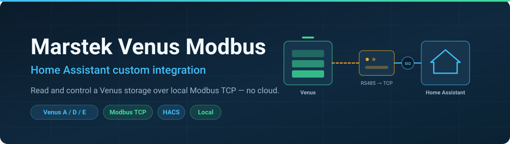
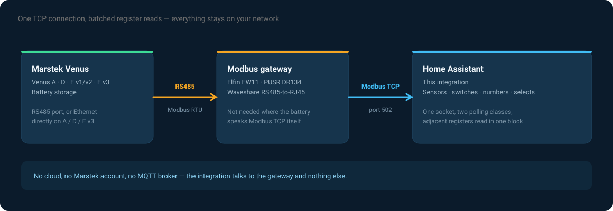
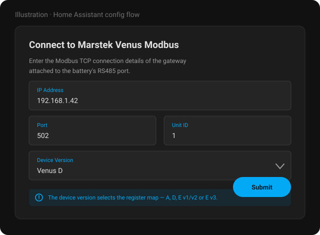
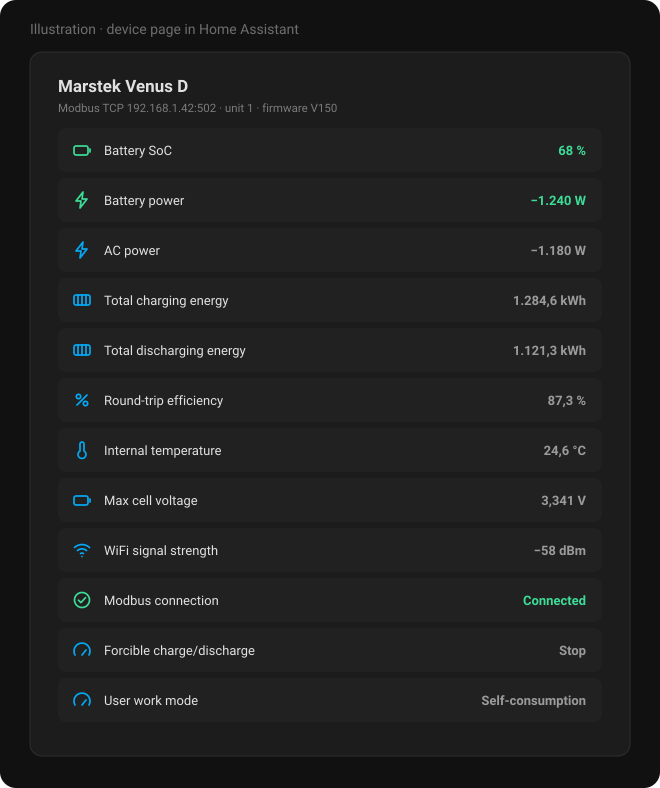

# Marstek Venus Modbus for Home Assistant

**Read and control a Marstek Venus battery over local Modbus TCP — no cloud, no app, no YAML.**

**English** · [Deutsch](README.de.md)

> [!NOTE]
> **This is a development fork** of [ViperRNMC/marstek_venus_modbus](https://github.com/ViperRNMC/marstek_venus_modbus).
> Credit for the integration goes to [@ViperRNMC](https://github.com/ViperRNMC). This fork carries
> additional Venus D register research and bug fixes; what exactly differs, and why, is documented
> in [UPSTREAM-DIVERGENCE.md](UPSTREAM-DIVERGENCE.md) so it can be carried upstream or dropped
> deliberately. Please report problems with **this fork** in this repository's issue tracker.

---

## What this integration does

A Marstek Venus storage exposes its whole state over **Modbus** — state of charge, power, cell
voltages, temperatures, energy counters — and it accepts commands over the same interface. This
custom integration for [Home Assistant](https://www.home-assistant.io) speaks that protocol
directly over TCP and turns the registers into Home Assistant entities.

No Marstek cloud account, no MQTT broker, no YAML. Configuration happens entirely in the UI.

### Why Modbus

Bluetooth reaches the battery from one phone at a time. The cloud reaches it from anywhere, but
only as far as Marstek's app allows, and only while their service is up. Modbus is the interface
that is always there, answers in milliseconds, and is read by inverters, PLCs and energy managers
alike — so Home Assistant sees **the same numbers from the same source** as everything else in
your setup.

---

## Requirements

- A **Modbus RTU-to-TCP bridge** on the battery's RS485 port
  - or an **Ethernet connection** straight to a battery that speaks Modbus TCP itself (e.g. Venus E3)
- The **IP address**, **port** (usually 502) and **Unit ID** (also called Slave ID) of that bridge
- Home Assistant **2025.9** or newer
- HACS, for convenient installation

### Tested hardware

| Gateway | Notes |
|---|---|
| Elfin EW11 | WiFi to RS485 |
| PUSR DR134 | Modbus gateway |
| Waveshare RS485 to RJ45 | Ethernet converter |
| M5Stack RS485 + Atom S3 Lite | [#25](https://github.com/ViperRNMC/marstek_venus_modbus/issues/25) |
| A / D / E v3 over Ethernet | No adapter needed — [#46](https://github.com/ViperRNMC/marstek_venus_modbus/issues/46#issuecomment-3631312782) · [#106](https://github.com/ViperRNMC/marstek_venus_modbus/issues/106) |

---

## Features

- Native Modbus TCP polling via `pymodbus`, fully asynchronous
- Central `DataUpdateCoordinator` with **per-entity polling priorities**
- **Contiguous block polling** — adjacent registers are fetched in one request, with automatic
  fallback to per-entity reads when a block read fails
- Scan intervals configurable in the options UI
- Dependency entities are always polled, even when the entity that needs them is disabled
- Sensors for voltage, current, SoC, power, energy and fault/alarm status (combined bits)
- Diagnostic entities for communication health, firmware version, BLE MAC address and
  communication-module firmware
- Adjustable charge/discharge power (model-dependent, up to 2500 W)
- Select entities for multi-state control (force mode, grid standard)
- Backup mode control, and charge/discharge to a target SoC
- Calculated sensors: round-trip efficiency (total and monthly) and stored energy
- Cycle sensors: the native counter where available, plus a calculated count
  (`discharged_energy / capacity`)
- Reset button for the battery management system
- Advanced sensors disabled by default, to keep the UI readable
- Entities grouped under one device
- UI-based configuration (config flow) — fully local

---

## Supported devices

| Device version | Register map |
|---|---|
| Venus A | `a.yaml` |
| Venus D | `d.yaml` |
| Venus E v1 / v2 | `e_v12.yaml` |
| Venus E v3 | `e_v3.yaml` |

> [!IMPORTANT]
> Venus **A**, **D** and **E v3** share one firmware base. Venus **E v1/v2** is built on a
> **completely different** one — a register finding from A/D/E3 firmware says nothing about E v1/v2,
> where a matching register number is coincidence until proven otherwise.

---

## Installation

1. Add this repository to HACS under **Integrations → Custom repositories** (category: Integration)
2. Install **Marstek Venus Modbus**
3. Restart Home Assistant
4. Add the integration via **Settings → Devices & Services**

> The images in this README are illustrations of the dialogs, not photographs of a running instance.

Enter the address of your Modbus TCP gateway, the port (default 502), the Unit ID (default 1,
valid range 1–255) and the device version — `A`, `D`, `E v1/v2` or `E v3`. The device version picks
the register map, so it has to match the actual hardware.

---

## Entities

Everything lands on one device. Advanced and diagnostic entities ship disabled by default — enable
what you need in the entity list rather than wading through everything at once.

---

## Configuration

### Connection settings

Configurable under **Options → Connection settings**:

- **IP address, port and Unit ID** of the Modbus TCP gateway
- **Wait between messages** (default 80 ms) — the pause the integration keeps between two Modbus
  requests

The wait applies to every request, so raising it lengthens every poll cycle and the integration's
startup in proportion: at 300 ms a cycle of 50 requests takes 15 seconds where 80 ms would take 4.
Raise it only when a gateway drops responses at the default, and lower it again once the connection
is stable.

### Polling intervals

The integration polls intelligently, with configurable intervals per class. Recent versions use
**two** polling classes instead of four; the coordinator still respects per-entity priorities, but
the user-facing options are reduced to the intervals that actually matter.

| Class | Default | Covers |
|---|---|---|
| **High priority** | 10 s | Fast-changing values — power, voltage, current, SoC, state entities |
| **Low priority** | 60 s | Slow-changing values — totals, diagnostics, firmware, device information |

Notes:

- Adjacent due registers are combined into a single block read where possible.
- If a block read fails, the affected entities fall back to individual reads.
- Disabled entities are skipped, unless a calculated sensor depends on them.

---

## What stays local

The integration talks to your gateway and to nothing else. There is no Marstek account involved, no
telemetry, and no outbound connection beyond the one TCP socket to the address you configured.

---

## Known issues

- **User Work Mode (AI Optimized) not reflected correctly**
  Setting `User Work Mode` to `2 (Trade Mode)` in Home Assistant may not show the updated state.
  The Marstek app shows the correct mode while Home Assistant keeps displaying the previous one,
  because of a discrepancy in the Modbus register response. This is a firmware-side issue.

- **The battery disappears from the network every 30 minutes**
  A few seconds with no Modbus and no ping, on a fixed rhythm. This is the device's own firmware
  resetting its network chip when it cannot reach Marstek's cloud — not this integration, and not
  your network. It cannot be prevented from here, only survived quickly, which is what 1.2.0 onwards
  does. Mechanism, and how to stop it: **[FIRMWARE-DROPOUTS.md](FIRMWARE-DROPOUTS.md)**.

---

## FAQ

**Do I need a gateway, or can the battery do Modbus TCP itself?**
Venus A, D and E v3 can be wired straight to Ethernet and speak Modbus TCP without an adapter. For
everything else you need an RS485-to-TCP bridge on the battery's RS485 port.

**Can I run this alongside another Modbus client?**
Most gateways serve one TCP client at a time. If an inverter or energy manager already holds the
connection, either use a gateway that multiplexes, or read the battery through that other system.

**Why are so many entities disabled by default?**
Because the register map is large. Everything is defined, but shipping all of it enabled would bury
the ten values most people actually want. Enable what you need in the entity list.

**Can this work together with venuscontrol?**
Yes, and they complement each other:
[venuscontrol](https://github.com/sphings79/venuscontrol) configures the battery over Bluetooth —
including switching on the interfaces this integration then reads over Modbus.

**Is my Venus E v1/v2 fully supported?**
It is defined in `e_v12.yaml`, but that model runs a different firmware base, and the register
research in this fork comes from A/D/E3 hardware. Treat E v1/v2 findings as unverified.

---

## Related projects

- 🖥️ **[venuscontrol](https://github.com/sphings79/venuscontrol)** — cloud-free Web Bluetooth control
  panel for Venus A / D, including OTA firmware updates
- 📦 **[Marstek firmware archive](https://github.com/sphings79/marstek-firmware-archiv)**
- 🛰️ **[Marstek Offline Endpoint](https://github.com/sphings79/Marstek-offline-endpoint)** — answers the
  telemetry upload locally, which stops the 30-minute network dropouts and keeps your data at home
- 🔬 **[Venus D firmware reverse engineering](https://github.com/sphings79/Marstek-Venus-D-Firmware-Reverse-Engineering)**
- 🌐 **[More projects and tools](https://sphings-dev.de/)**

## Credits

- Upstream integration: **[ViperRNMC/marstek_venus_modbus](https://github.com/ViperRNMC/marstek_venus_modbus)**

---

## 📘 Modbus Registers Used

Register definitions live in `custom_components/marstek_modbus/registers/`.

Below is a per-key table showing descriptive fields and the register defined in each YAML file. Columns `Type`, `Bytes`, `Scale` and `Unit` are taken from the YAML definitions when present.

| Key / Name                        | Description                                | Type    | Bytes | Scale  | Unit | a     | d     | e_v12 | e_v3 |
|:----------------------------------|:-------------------------------------------|:--------|:-----:|:------:|:----:|:-----:|:-----:|:------:|:-----:|
| device_name                       | Device name (string)                       | char    | 20   | -      | -    | 31000 | 31000 | 31000 | 31000 |
| sn_code                           | Device serial / SN code                    | char    | 20   | -      | -    |       |       | 31200 |       |
| software_version                  | Device software version                    | uint16  | 2    | 0.01   | -    |       |       | 31100 |       |
| bms_version                       | BMS firmware version                       | uint16  | 2    | -      | -    | 30204 | 30204 | 31102 | 30204 |
| vms_version                       | VMS firmware version                       | uint16  | 2    | -      | -    | 30202 | 30202 |       | 30202 |
| ems_version                       | EMS firmware version (special formatting)  | uint16  | 2    | 1      | -    | 30200 | 30200 | 31101 | 30200 |
| firmware_version                  | Combined firmware version string           | calculated | - | - | - |  |  |  |  |
| ble_mac_address                   | BLE MAC address                            | mac     | 12   | -      | -    | 30304 | 30304 | 30402 | 30304 |
| comm_module_firmware              | Communication module firmware              | char    | 12   | -      | -    | 30350 | 30350 | 30800 | 30350 |
| wifi_signal_strength              | WiFi RSSI                                  | uint16  | 2    | -1     | dBm  | 30303 | 30303 | 30303 | 30303 |
| bluetooth_status                  | Bluetooth connectivity/status              | uint16  | 2    | -      | -    | 30301 | 30301 | 30301 | 30301 |
| wifi_status (binary)              | WiFi connected (0/1)                       | uint16  | 2    | 1      | -    | 30300 | 30300 | 30300 | 30300 |
| cloud_status (binary)             | Cloud connected (0/1)                      | uint16  | 2    | 1      | -    | 30302 | 30302 | 30302 | 30302 |
| battery_soc                       | State of charge                            | uint16  | 2    | 0.1/1  | %    | 34002 | 34002 | 32104 | 34002 |
| battery_total_energy              | Total stored energy                        | uint16  | 2    | 0.001  | kWh  | 32105 | 32105 | 32105 | 32105 |
| battery_voltage                   | Battery voltage                            | uint16  | 2    | 0.01   | V    | 30100 | 30100 | 32100 | 30100 |
| battery_current                   | Battery current                            | int16   | 2    | 0.1/0.01| A   | 30101 | 30101 | 32101 | 30101 |
| battery_power                     | Battery power                              | int16/32| 2/4  | 1      | W    | 30001 | 30001 | 32102 | 30001 |
| total_charging_energy             | Total charging energy                      | uint32  | 4    | 0.01   | kWh  | 33000 | 33000 | 33000 | 33000 |
| total_discharging_energy          | Total discharging energy                   | int32   | 4    | 0.01   | kWh  | 33002 | 33002 | 33002 | 33002 |
| total_daily_charging_energy       | Total daily charging energy                | uint32  | 4    | 0.01   | kWh  | 33004 | 33004 | 33004 | 33004 |
| total_daily_discharging_energy    | Total daily discharging energy             | int32   | 4    | 0.01   | kWh  | 33006 | 33006 | 33006 | 33006 |
| total_monthly_charging_energy     | Total monthly charging energy              | uint32  | 4    | 0.01   | kWh  | 33008 | 33008 | 33008 | 33008 |
| total_monthly_discharging_energy  | Total monthly discharging energy           | int32   | 4    | 0.01   | kWh  | 33010 | 33010 | 33010 | 33010 |
| battery_cycle_count               | Native cycle counter                       | uint16  | 2    | 1      | -    | 34003 | 34003 |       | 34003 |
| ac_voltage                        | AC voltage                                 | uint16  | 2    | 0.1    | V    | 32200 | 32200 | 32200 | 32200 |
| ac_current                        | AC current                                 | int16   | 2    | 0.004/0.01| A  | 37004 | 37004 | 32201 | 37004 |
| ac_power                          | AC power                                   | int16/32| 2/4  | 1      | W    | 30006 | 30006 | 32202 | 30006 |
| ac_frequency                      | AC frequency                               | int16   | 2    | 0.1/0.01| Hz  | 32204 | 32204 | 32204 | 32204 |
| ac_offgrid_voltage                | AC offgrid voltage                         | uint16  | 2    | 0.1    | V    | 32300 | 32300 | 32300 | 32300 |
| ac_offgrid_current                | AC offgrid current                         | uint16  | 2    | 0.01   | A    | 32301 | 32301 | 32301 | 32301 |
| ac_offgrid_power                  | AC offgrid power                           | int32   | 4    | 1      | W    | 32302 | 32302 | 32302 | 32302 |
| internal_temperature              | Internal device temperature                | int16   | 2    | 0.1    | °C   | 35000 | 35000 | 35000 | 35000 |
| internal_mos1_temperature         | MOS1 internal temperature                  | int16   | 2    | 0.1    | °C   | 35001 | 35001 | 35001 | 35001 |
| internal_mos2_temperature         | MOS2 internal temperature                  | int16   | 2    | 0.1    | °C   | 35002 | 35002 | 35002 | 35002 |
| max_cell_temperature              | Max cell temperature                       | int16   | 2    | 0.1/1  | °C   | 35010 | 35010 | 35010 | 35010 |
| max_cell_voltage                  | Max cell voltage                           | uint16  | 2    | 0.001  | V    | 37007 | —     | 37007 | 37007 |
| min_cell_voltage                  | Min cell voltage                           | uint16  | 2    | 0.001  | V    | 37008 | —     | 37008 | 37008 |
| battery_1_cell_1_voltage            | Battery pack 1 cell 1 voltage               | int16   | 2    | 0.001  | V    | 34018 | 34018 |       | 34018 |
| battery_1_cell_2_voltage            | Battery pack 1 cell 2 voltage               | int16   | 2    | 0.001  | V    | 34019 | 34019 |       | 34019 |
| battery_1_cell_3_voltage            | Battery pack 1 cell 3 voltage               | int16   | 2    | 0.001  | V    | 34020 | 34020 |       | 34020 |
| battery_1_cell_4_voltage            | Battery pack 1 cell 4 voltage               | int16   | 2    | 0.001  | V    | 34021 | 34021 |       | 34021 |
| battery_1_cell_5_voltage            | Battery pack 1 cell 5 voltage               | int16   | 2    | 0.001  | V    | 34022 | 34022 |       | 34022 |
| battery_1_cell_6_voltage            | Battery pack 1 cell 6 voltage               | int16   | 2    | 0.001  | V    | 34023 | 34023 |       | 34023 |
| battery_1_cell_7_voltage            | Battery pack 1 cell 7 voltage               | int16   | 2    | 0.001  | V    | 34024 | 34024 |       | 34024 |
| battery_1_cell_8_voltage            | Battery pack 1 cell 8 voltage               | int16   | 2    | 0.001  | V    | 34025 | 34025 |       | 34025 |
| battery_1_cell_9_voltage            | Battery pack 1 cell 9 voltage               | int16   | 2    | 0.001  | V    | 34026 | 34026 |       | 34026 |
| battery_1_cell_10_voltage           | Battery pack 1 cell 10 voltage              | int16   | 2    | 0.001  | V    | 34027 | 34027 |       | 34027 |
| battery_1_cell_11_voltage           | Battery pack 1 cell 11 voltage              | int16   | 2    | 0.001  | V    | 34028 | 34028 |       | 34028 |
| battery_1_cell_12_voltage           | Battery pack 1 cell 12 voltage              | int16   | 2    | 0.001  | V    | 34029 | 34029 |       | 34029 |
| battery_1_cell_13_voltage           | Battery pack 1 cell 13 voltage              | int16   | 2    | 0.001  | V    | 34030 | 34030 |       | 34030 |
| battery_1_cell_14_voltage           | Battery pack 1 cell 14 voltage              | int16   | 2    | 0.001  | V    |       | 34031 |       | 34031 |
| battery_1_cell_15_voltage           | Battery pack 1 cell 15 voltage              | int16   | 2    | 0.001  | V    |       | 34032 |       | 34032 |
| battery_1_cell_16_voltage           | Battery pack 1 cell 16 voltage              | int16   | 2    | 0.001  | V    |       | 34033 |       | 34033 |
| battery_2_cell_1_voltage            | Battery pack 2 cell 1 voltage               | int16   | 2    | 0.001  | V    | 34031 |       |       |       |
| battery_2_cell_2_voltage            | Battery pack 2 cell 2 voltage               | int16   | 2    | 0.001  | V    | 34032 |       |       |       |
| battery_2_cell_3_voltage            | Battery pack 2 cell 3 voltage               | int16   | 2    | 0.001  | V    | 34033 |       |       |       |
| battery_2_cell_4_voltage            | Battery pack 2 cell 4 voltage               | int16   | 2    | 0.001  | V    | 34034 |       |       |       |
| battery_2_cell_5_voltage            | Battery pack 2 cell 5 voltage               | int16   | 2    | 0.001  | V    | 34035 |       |       |       |
| battery_2_cell_6_voltage            | Battery pack 2 cell 6 voltage               | int16   | 2    | 0.001  | V    | 34036 |       |       |       |
| battery_2_cell_7_voltage            | Battery pack 2 cell 7 voltage               | int16   | 2    | 0.001  | V    | 34037 |       |       |       |
| battery_2_cell_8_voltage            | Battery pack 2 cell 8 voltage               | int16   | 2    | 0.001  | V    | 34038 |       |       |       |
| battery_2_cell_9_voltage            | Battery pack 2 cell 9 voltage               | int16   | 2    | 0.001  | V    | 34039 |       |       |       |
| battery_2_cell_10_voltage           | Battery pack 2 cell 10 voltage              | int16   | 2    | 0.001  | V    | 34040 |       |       |       |
| battery_2_cell_11_voltage           | Battery pack 2 cell 11 voltage              | int16   | 2    | 0.001  | V    | 34041 |       |       |       |
| battery_2_cell_12_voltage           | Battery pack 2 cell 12 voltage              | int16   | 2    | 0.001  | V    | 34042 |       |       |       |
| battery_2_cell_13_voltage           | Battery pack 2 cell 13 voltage              | int16   | 2    | 0.001  | V    | 34043 |       |       |       |
| battery_3_cell_1_voltage            | Battery pack 3 cell 1 voltage               | int16   | 2    | 0.001  | V    | 34044 |       |       |       |
| battery_3_cell_2_voltage            | Battery pack 3 cell 2 voltage               | int16   | 2    | 0.001  | V    | 34045 |       |       |       |
| battery_3_cell_3_voltage            | Battery pack 3 cell 3 voltage               | int16   | 2    | 0.001  | V    | 34046 |       |       |       |
| battery_3_cell_4_voltage            | Battery pack 3 cell 4 voltage               | int16   | 2    | 0.001  | V    | 34047 |       |       |       |
| battery_3_cell_5_voltage            | Battery pack 3 cell 5 voltage               | int16   | 2    | 0.001  | V    | 34048 |       |       |       |
| battery_3_cell_6_voltage            | Battery pack 3 cell 6 voltage               | int16   | 2    | 0.001  | V    | 34049 |       |       |       |
| battery_3_cell_7_voltage            | Battery pack 3 cell 7 voltage               | int16   | 2    | 0.001  | V    | 34050 |       |       |       |
| battery_3_cell_8_voltage            | Battery pack 3 cell 8 voltage               | int16   | 2    | 0.001  | V    | 34051 |       |       |       |
| battery_3_cell_9_voltage            | Battery pack 3 cell 9 voltage               | int16   | 2    | 0.001  | V    | 34052 |       |       |       |
| battery_3_cell_10_voltage           | Battery pack 3 cell 10 voltage              | int16   | 2    | 0.001  | V    | 34053 |       |       |       |
| battery_3_cell_11_voltage           | Battery pack 3 cell 11 voltage              | int16   | 2    | 0.001  | V    | 34054 |       |       |       |
| battery_3_cell_12_voltage           | Battery pack 3 cell 12 voltage              | int16   | 2    | 0.001  | V    | 34055 |       |       |       |
| battery_3_cell_13_voltage           | Battery pack 3 cell 13 voltage              | int16   | 2    | 0.001  | V    | 34056 |       |       |       |
| battery_4_cell_1_voltage            | Battery pack 4 cell 1 voltage               | int16   | 2    | 0.001  | V    | 34057 |       |       |       |
| battery_4_cell_2_voltage            | Battery pack 4 cell 2 voltage               | int16   | 2    | 0.001  | V    | 34058 |       |       |       |
| battery_4_cell_3_voltage            | Battery pack 4 cell 3 voltage               | int16   | 2    | 0.001  | V    | 34059 |       |       |       |
| battery_4_cell_4_voltage            | Battery pack 4 cell 4 voltage               | int16   | 2    | 0.001  | V    | 34060 |       |       |       |
| battery_4_cell_5_voltage            | Battery pack 4 cell 5 voltage               | int16   | 2    | 0.001  | V    | 34061 |       |       |       |
| battery_4_cell_6_voltage            | Battery pack 4 cell 6 voltage               | int16   | 2    | 0.001  | V    | 34062 |       |       |       |
| battery_4_cell_7_voltage            | Battery pack 4 cell 7 voltage               | int16   | 2    | 0.001  | V    | 34063 |       |       |       |
| battery_4_cell_8_voltage            | Battery pack 4 cell 8 voltage               | int16   | 2    | 0.001  | V    | 34064 |       |       |       |
| battery_4_cell_9_voltage            | Battery pack 4 cell 9 voltage               | int16   | 2    | 0.001  | V    | 34065 |       |       |       |
| battery_4_cell_10_voltage           | Battery pack 4 cell 10 voltage              | int16   | 2    | 0.001  | V    | 34066 |       |       |       |
| battery_4_cell_11_voltage           | Battery pack 4 cell 11 voltage              | int16   | 2    | 0.001  | V    | 34067 |       |       |       |
| battery_4_cell_12_voltage           | Battery pack 4 cell 12 voltage              | int16   | 2    | 0.001  | V    | 34068 |       |       |       |
| battery_4_cell_13_voltage           | Battery pack 4 cell 13 voltage              | int16   | 2    | 0.001  | V    | 34069 |       |       |       |
| battery_5_cell_1_voltage            | Battery pack 5 cell 1 voltage               | int16   | 2    | 0.001  | V    | 34070 |       |       |       |
| battery_5_cell_2_voltage            | Battery pack 5 cell 2 voltage               | int16   | 2    | 0.001  | V    | 34071 |       |       |       |
| battery_5_cell_3_voltage            | Battery pack 5 cell 3 voltage               | int16   | 2    | 0.001  | V    | 34072 |       |       |       |
| battery_5_cell_4_voltage            | Battery pack 5 cell 4 voltage               | int16   | 2    | 0.001  | V    | 34073 |       |       |       |
| battery_5_cell_5_voltage            | Battery pack 5 cell 5 voltage               | int16   | 2    | 0.001  | V    | 34074 |       |       |       |
| battery_5_cell_6_voltage            | Battery pack 5 cell 6 voltage               | int16   | 2    | 0.001  | V    | 34075 |       |       |       |
| battery_5_cell_7_voltage            | Battery pack 5 cell 7 voltage               | int16   | 2    | 0.001  | V    | 34076 |       |       |       |
| battery_5_cell_8_voltage            | Battery pack 5 cell 8 voltage               | int16   | 2    | 0.001  | V    | 34077 |       |       |       |
| battery_5_cell_9_voltage            | Battery pack 5 cell 9 voltage               | int16   | 2    | 0.001  | V    | 34078 |       |       |       |
| battery_5_cell_10_voltage           | Battery pack 5 cell 10 voltage              | int16   | 2    | 0.001  | V    | 34079 |       |       |       |
| battery_5_cell_11_voltage           | Battery pack 5 cell 11 voltage              | int16   | 2    | 0.001  | V    | 34080 |       |       |       |
| battery_5_cell_12_voltage           | Battery pack 5 cell 12 voltage              | int16   | 2    | 0.001  | V    | 34081 |       |       |       |
| battery_5_cell_13_voltage           | Battery pack 5 cell 13 voltage              | int16   | 2    | 0.001  | V    | 34082 |       |       |       |
| battery_6_cell_1_voltage            | Battery pack 6 cell 1 voltage               | int16   | 2    | 0.001  | V    | 34083 |       |       |       |
| battery_6_cell_2_voltage            | Battery pack 6 cell 2 voltage               | int16   | 2    | 0.001  | V    | 34084 |       |       |       |
| battery_6_cell_3_voltage            | Battery pack 6 cell 3 voltage               | int16   | 2    | 0.001  | V    | 34085 |       |       |       |
| battery_6_cell_4_voltage            | Battery pack 6 cell 4 voltage               | int16   | 2    | 0.001  | V    | 34086 |       |       |       |
| battery_6_cell_5_voltage            | Battery pack 6 cell 5 voltage               | int16   | 2    | 0.001  | V    | 34087 |       |       |       |
| battery_6_cell_6_voltage            | Battery pack 6 cell 6 voltage               | int16   | 2    | 0.001  | V    | 34088 |       |       |       |
| battery_6_cell_7_voltage            | Battery pack 6 cell 7 voltage               | int16   | 2    | 0.001  | V    | 34089 |       |       |       |
| battery_6_cell_8_voltage            | Battery pack 6 cell 8 voltage               | int16   | 2    | 0.001  | V    | 34090 |       |       |       |
| battery_6_cell_9_voltage            | Battery pack 6 cell 9 voltage               | int16   | 2    | 0.001  | V    | 34091 |       |       |       |
| battery_6_cell_10_voltage           | Battery pack 6 cell 10 voltage              | int16   | 2    | 0.001  | V    | 34092 |       |       |       |
| battery_6_cell_11_voltage           | Battery pack 6 cell 11 voltage              | int16   | 2    | 0.001  | V    | 34093 |       |       |       |
| battery_6_cell_12_voltage           | Battery pack 6 cell 12 voltage              | int16   | 2    | 0.001  | V    | 34094 |       |       |       |
| battery_6_cell_13_voltage           | Battery pack 6 cell 13 voltage              | int16   | 2    | 0.001  | V    | 34095 |       |       |       |
| mppt1_voltage                     | MPPT1 array voltage                        | uint16  | 2    | 0.1    | V    | 30020 | 30020 |       |       |
| mppt1_current                     | MPPT1 array current                        | uint16  | 2    | 0.1    | A    | 30024 | 30024 |       |       |
| mppt1_power                       | MPPT1 array power                          | uint16  | 2    | 0.1    | W    | 30037 | 30037 |       |       |
| mppt2_voltage                     | MPPT2 array voltage                        | uint16  | 2    | 0.1    | V    | 30021 | 30021 |       |       |
| mppt2_current                     | MPPT2 array current                        | uint16  | 2    | 0.1    | A    | 30025 | 30025 |       |       |
| mppt2_power                       | MPPT2 array power                          | uint16  | 2    | 0.1    | W    | 30038 | 30038 |       |       |
| mppt3_voltage                     | MPPT3 array voltage                        | uint16  | 2    | 0.1    | V    | 30022 | 30022 |       |       |
| mppt3_current                     | MPPT3 array current                        | uint16  | 2    | 0.1    | A    | 30026 | 30026 |       |       |
| mppt3_power                       | MPPT3 array power                          | uint16  | 2    | 0.1    | W    | 30039 | 30039 |       |       |
| mppt4_voltage                     | MPPT4 array voltage                        | uint16  | 2    | 0.1    | V    | 30023 | 30023 |       |       |
| mppt4_current                     | MPPT4 array current                        | uint16  | 2    | 0.1    | A    | 30027 | 30027 |       |       |
| mppt4_power                       | MPPT4 array power                          | uint16  | 2    | 0.1    | W    | 30040 | 30040 |       |       |
| inverter_state                    | Inverter / device state                    | uint16  | 2    | 1      | -    | 35100 | 35100 | 35100 | 35100 |
| fault_status                      | Fault status bits                          | uint64  | 8    | -      | -    |       |       | 36100 |       |
| alarm_status                      | Alarm status bits                          | uint32  | 4    | -      | -    |       |       | 36000 |       |
| modbus_address                    | Modbus slave/unit id                       | uint16  | 2    | -      | -    | 41100 | 41100 | 41100 | 41100 |
| rs485_control_mode (switch)       | RS485 control mode (write commands)        | uint16  | 2    | -      | -    | 42000 | 42000 | 42000 | 42000 |
| backup_function (switch)          | Backup function control                    | uint16  | 2    | -      | -    | 41200 | 41200 | 41200 | 41200 |
| force_mode (select)               | Force mode (None/Charge/Discharge)         | uint16  | 2    | -      | -    | 42010 | 42010 | 42010 | 42010 |
| user_work_mode (select)           | User Work Mode (manual/anti_feed/trade)    | uint16  | 2    | -      | -    | 43000 | 43000 | 43000 | 43000 |
| discharge_limit_mode (binary)     | Discharge limit mode (diagnostic)          | uint16  | 2    | -      | -    |       |       | 41010 |       |
| modbus_connection (binary)        | Modbus connection health                   | derived | -    | -      | -    |  |  |  |  |
| grid_standard (select)            | Grid standard / region selection           | uint16  | 2    | -      | -    |       |       | 44100 |       |
| charge_to_soc (number)            | Charge/discharge to SOC (0-100%)           | uint16  | 2    | 1      | %    | 42011 | 42011 | 42011 | 42011 |
| set_charge_power (number)         | Forcible charge power setpoint             | uint16  | 2    | -      | W    | 42020 | 42020 | 42020 | 42020 |
| set_discharge_power (number)      | Forcible discharge power setpoint          | uint16  | 2    | -      | W    | 42021 | 42021 | 42021 | 42021 |
| max_charge_power (number)         | Max allowed charge power                   | uint16  | 2    | -      | W    | 44002 | 44002 | 44002 | 44002 |
| max_discharge_power (number)      | Max allowed discharge power                | uint16  | 2    | -      | W    | 44003 | 44003 | 44003 | 44003 |
| charging_cutoff_capacity (number) | Charging cutoff (percentage)               | uint16  | 2    | 0.1    | %    |       |       | 44000 |       |
| discharging_cutoff_capacity       | Discharging cutoff (percentage)            | uint16  | 2    | 0.1    | %    |       |       | 44001 |       |
| reset_device (button)             | Reset device command                       | uint16  | 2    | -      | -    | 41000 | 41000 | 41000 | 41000 |
| factory_reset (button)            | Factory reset command                      | uint16  | 2    | -      | -    | 41001 | 41001 | 41001 | 41001 |
| schedule_1_days                  | Schedule 1 days (bitmask)                   | bit      | 2    | -      | -    | 43100 | 43100 | 43100 | 43100 |
| schedule_1_start                 | Schedule 1 start (HHMM)                     | uint     | 2    | -      | min  | 43101 | 43101 | 43101 | 43101 |
| schedule_1_end                   | Schedule 1 end (HHMM)                       | uint     | 2    | -      | min  | 43102 | 43102 | 43102 | 43102 |
| schedule_1_mode                  | Schedule 1 mode (numeric)                   | int16    | 2    | -      | W    | 43103 | 43103 | 43103 | 43103 |
| schedule_1_enabled               | Schedule 1 enabled (0/1)                    | uint     | 2    | -      | -    | 43104 | 43104 | 43104 | 43104 |
| schedule_2_days                  | Schedule 2 days (bitmask)                   | bit      | 2    | -      | -    | 43105 | 43105 | 43105 | 43105 |
| schedule_2_start                 | Schedule 2 start (HHMM)                     | uint     | 2    | -      | min  | 43106 | 43106 | 43106 | 43106 |
| schedule_2_end                   | Schedule 2 end (HHMM)                       | uint     | 2    | -      | min  | 43107 | 43107 | 43107 | 43107 |
| schedule_2_mode                  | Schedule 2 mode (numeric)                   | int16    | 2    | -      | W    | 43108 | 43108 | 43108 | 43108 |
| schedule_2_enabled               | Schedule 2 enabled (0/1)                    | uint     | 2    | -      | -    | 43109 | 43109 | 43109 | 43109 |
| schedule_3_days                  | Schedule 3 days (bitmask)                   | bit      | 2    | -      | -    | 43110 | 43110 | 43110 | 43110 |
| schedule_3_start                 | Schedule 3 start (HHMM)                     | uint     | 2    | -      | min  | 43111 | 43111 | 43111 | 43111 |
| schedule_3_end                   | Schedule 3 end (HHMM)                       | uint     | 2    | -      | min  | 43112 | 43112 | 43112 | 43112 |
| schedule_3_mode                  | Schedule 3 mode (numeric)                   | int16    | 2    | -      | W    | 43113 | 43113 | 43113 | 43113 |
| schedule_3_enabled               | Schedule 3 enabled (0/1)                    | uint     | 2    | -      | -    | 43114 | 43114 | 43114 | 43114 |
| schedule_4_days                  | Schedule 4 days (bitmask)                   | bit      | 2    | -      | -    | 43115 | 43115 | 43115 | 43115 |
| schedule_4_start                 | Schedule 4 start (HHMM)                     | uint     | 2    | -      | min  | 43116 | 43116 | 43116 | 43116 |
| schedule_4_end                   | Schedule 4 end (HHMM)                       | uint     | 2    | -      | min  | 43117 | 43117 | 43117 | 43117 |
| schedule_4_mode                  | Schedule 4 mode (numeric)                   | int16    | 2    | -      | W    | 43118 | 43118 | 43118 | 43118 |
| schedule_4_enabled               | Schedule 4 enabled (0/1)                    | uint     | 2    | -      | -    | 43119 | 43119 | 43119 | 43119 |
| schedule_5_days                  | Schedule 5 days (bitmask)                   | bit      | 2    | -      | -    | 43120 | 43120 | 43120 | 43120 |
| schedule_5_start                 | Schedule 5 start (HHMM)                     | uint     | 2    | -      | min  | 43121 | 43121 | 43121 | 43121 |
| schedule_5_end                   | Schedule 5 end (HHMM)                       | uint     | 2    | -      | min  | 43122 | 43122 | 43122 | 43122 |
| schedule_5_mode                  | Schedule 5 mode (numeric)                   | int16    | 2    | -      | W    | 43123 | 43123 | 43123 | 43123 |
| schedule_5_enabled               | Schedule 5 enabled (0/1)                    | uint     | 2    | -      | -    | 43124 | 43124 | 43124 | 43124 |
| schedule_6_days                  | Schedule 6 days (bitmask)                   | bit      | 2    | -      | -    | 43125 | 43125 | 43125 | 43125 |
| schedule_6_start                 | Schedule 6 start (HHMM)                     | uint     | 2    | -      | min  | 43126 | 43126 | 43126 | 43126 |
| schedule_6_end                   | Schedule 6 end (HHMM)                       | uint     | 2    | -      | min  | 43127 | 43127 | 43127 | 43127 |
| schedule_6_mode                  | Schedule 6 mode (numeric)                   | int16    | 2    | -      | W    | 43128 | 43128 | 43128 | 43128 |
| schedule_6_enabled               | Schedule 6 enabled (0/1)                    | uint     | 2    | -      | -    | 43129 | 43129 | 43129 | 43129 |
| round_trip_efficiency_total       | Round-trip efficiency (total charge/discharge energies) | calculated | - | - | % |  |  |  |  |
| round_trip_efficiency_monthly     | Round-trip efficiency (monthly charge/discharge) | calculated | - | - | % |  |  |  |  |
| conversion_efficiency             | Conversion efficiency (battery ↔ AC)       | calculated | - | - | % |  |  |  |  |
| stored_energy                     | Stored battery energy (SOC × capacity)     | calculated | - | - | kWh |  |  |  |  |
| battery_cycle_count_calc          | Cycle count calculated from total discharge and capacity | calculated | - | - | - |  |  |  |  |

_Notes:_
- `charge_to_soc` (42011, "Maximaler SoC") is a command, not a passive setting: writing it makes the device drive the battery to that state of charge straight away — verified on hardware, writing 70 started a discharge that stopped at 70 %. It is **not** the backup reserve shown in the Marstek app; that is a separate, persistent parameter with no Modbus register at all.
- `max_discharge_power` (44003) is a free limit, not a three-step selector: setting 1350 W and then commanding a 2500 W discharge produced 1355 W on hardware. It shares its EEPROM word with the app's 800 / 2200 / 2500 W device power class, so writing it restores the power after the cloud has reset the class to 800 — which shows up in practice as a discharge that refuses to exceed 800 W. The cloud command additionally sets a tier flag and, at 800 W, clamps every schedule slot; writing the register does neither. The register is write-only, so the active value cannot be read back.
- `max_cell_voltage` / `min_cell_voltage` are **not** device-wide on Venus D: 37007/37008 read the same firmware source as `battery_1_max_cell_voltage` / `battery_1_min_cell_voltage` (34005/34006), i.e. pack 1 only. They were removed from `d.yaml`; use the per-pack sensors instead.
- Columns `a`, `d`, `e_v12` and `e_v3` correspond to the YAML files under `custom_components/marstek_modbus/registers/`.
- `Bytes` shows the typical byte size for the key (each Modbus register = 2 bytes).
- Blank cells mean that YAML does not define that key (or the value is calculated and has no direct Modbus register).
- `firmware_version` is assembled from the raw version registers. `E v1/v2` uses `ems + bms`; `A`, `D` and `E v3` use `ems + vms + bms`.
- `ble_mac_address` is decoded and formatted as a normal MAC address string such as `00:9B:08:05:D9:0A`.
- `modbus_connection` is a diagnostic binary sensor derived from recent successful Modbus reads, not from a separate device register.
- The `rs485_control_mode` switch (register 42000) uses write commands (command_on=21930, command_off=21947) to trigger RS485 control operations; use with caution.
- For access to registers in the 42000–42999 range, the battery must be set to RS485 control mode.
- Schedule Time format: `start` and `end` are entered as HHMM 24-hour integers (for example `0830` = 08:30). Use values within the valid range shown in the YAML for each device; ensure `start` is earlier than `end` for a single active period.
- Schedule Day selection: the underlying `schedule_*_days` register uses a bitmask to represent multiple days, but the integration currently exposes it as a single-select option in Home Assistant. Due to this limitation you cannot select multiple days from the integration UI.
- Energy Dashboard caveat (Venus A / Venus D with PV input): reported battery charge/discharge energy registers may include energy that flows to household loads via the inverter path, not only net battery-in/out energy. This can lead to misleading Home Assistant Energy Dashboard battery statistics. For accurate dashboard usage, prefer custom derived sensors (for example from power integration) and validate behavior on your firmware/device.
- Schedule Mode values: `schedule_*_mode` accepts the following ranges:
  - `-1` = Self consumption mode
  - Charge/discharge range is model-dependent.
  - Venus A (fw v148+): `-100` to `-1500` (charge), `100` to `1500` (discharge)
  - Venus D / Venus E: `-100` to `-2500` (charge), `100` to `2500` (discharge)

---

## ☕ Support

These tools are built and maintained in my free time, and they stay free, open and cloud-free.
If one of them saved you an afternoon, you can [buy me a coffee](https://buymeacoffee.com/sphings).

